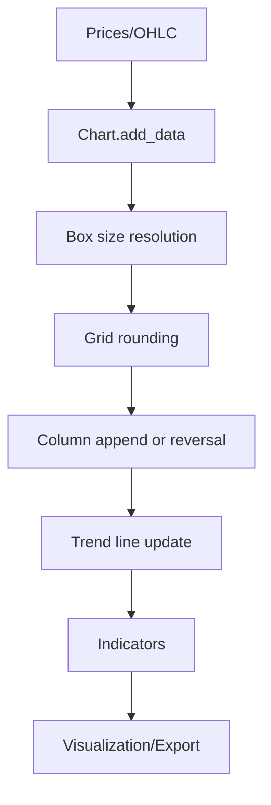
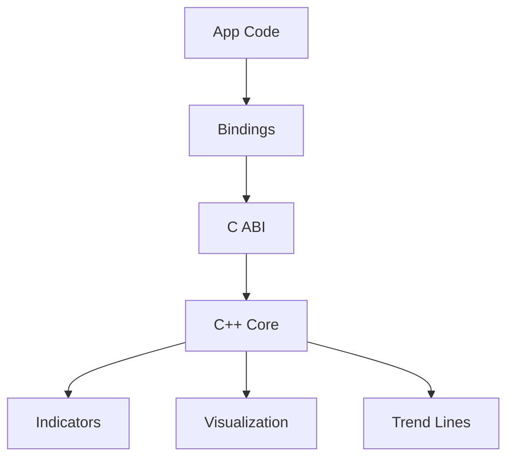
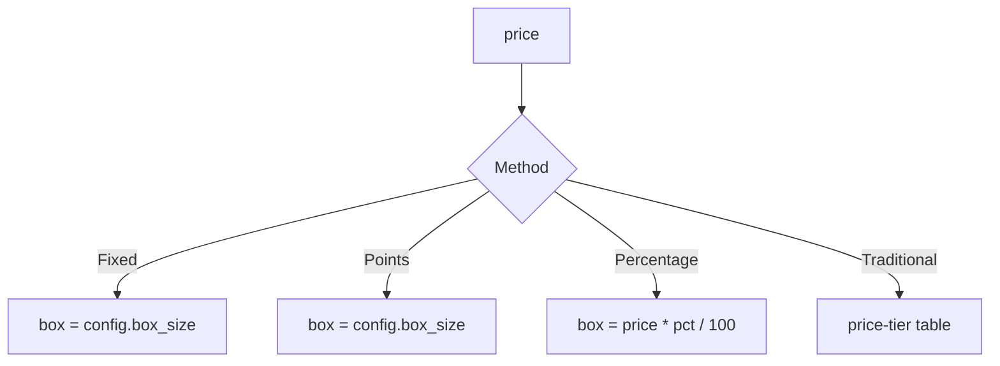
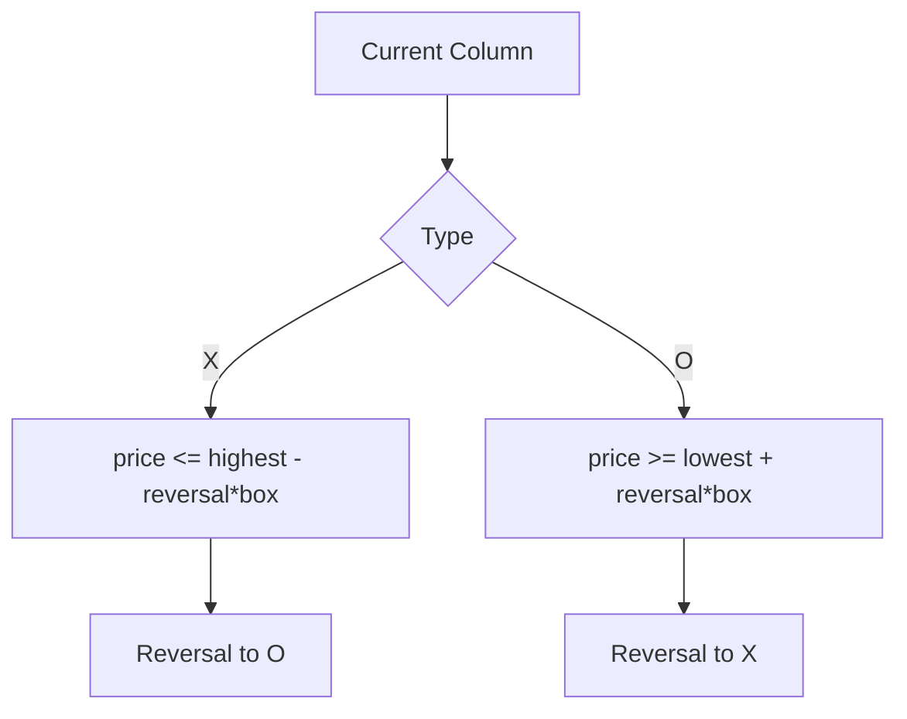

# PnF: Point & Figure Chart Library


## Overview

The PnF library builds Point & Figure charts by converting price movements into discrete boxes and columns. The design centers on a core C++ engine and a stable C ABI for language bindings.

### Concepts (Quick)

- **Box**: A single X or O at a price level.
- **Column**: A vertical run of boxes in one direction.
- **Reversal**: A directional change after a configured number of boxes.
- **Box Size**: The price increment per box; can be Fixed, Traditional, Percentage, or Points.

### Core Flow



A professional-grade C++ library for Point & Figure (P&F) charting with multi-language bindings.

Docs:
- [Documentation Home](docs/index.md)
- [Getting Started](docs/getting-started/overview.md)
- [Build and Test](docs/getting-started/build-and-test.md)
- [Architecture](docs/architecture.md)
- [C++ API Reference](docs/reference/cpp-api.md)
- [API Symbol Index (Generated)](docs/reference/api-symbol-index.md)
- [Numeric Examples](docs/examples.md)
- [Guides: Common Workflows](docs/guides/common-workflows.md)
- [Guides: Troubleshooting](docs/guides/troubleshooting.md)
- [Operations: Compatibility Matrix](docs/operations/compatibility-matrix.md)
- [Operations: Release and Versioning](docs/operations/release-and-versioning.md)
- [Project Changelog](CHANGELOG.md)
- [Bindings (C ABI)](docs/bindings/c-abi.md)
- [Bindings (Python)](docs/bindings/python.md)
- [Bindings (Java)](docs/bindings/java.md)
- [Bindings (Rust)](docs/bindings/rust.md)
- [Bindings (C#)](docs/bindings/csharp.md)

## At a Glance




### Deep Concepts

#### Box Size Resolution



#### Reversal Logic



#### Indicator Summary

- **SMA**: Average of column midpoints over a period
- **Bollinger**: SMA ± (std dev * multiplier)
- **RSI**: Gain/loss ratio mapped to 0–100
- **OBV**: Volume flow by close direction
- **Signals**: Buy/sell signals based on breakouts
- **Patterns**: Multiple P&F patterns detected per column
- **S/R**: Merge levels by relative threshold
- **Objectives**: Vertical count targets
- **Congestion**: Zones by relative range threshold


## Features

- Multiple construction methods (Close, High/Low)
- Multiple box size strategies (Fixed, Traditional, Percentage, Points)
- Indicators: SMA, Bollinger, RSI, OBV, signals, patterns, S/R, objectives, congestion
- Exports: ASCII, JSON, CSV
- Bindings: Python, Java, Rust, C#

## Documentation and Version Governance

- Canonical release version: root `VERSION`
- Release notes and change history: `CHANGELOG.md`
- Cross-binding version consistency check:
  - `python3 tools/check_versions.py`
- Generated exhaustive API symbol index:
  - `python3 tools/generate_api_symbol_index.py`
- API docs coverage validation:
  - `python3 tools/check_docs_coverage.py`

## Build (C++ Core)

```bash
git clone --recursive https://github.com/gregorian-09/pnf-chart-system.git
cd pnf-chart-system
cmake -S . -B build-linux -DCMAKE_BUILD_TYPE=Release -DPNF_BUILD_VIEWER=OFF
cmake --build build-linux -j$(nproc)
ctest --test-dir build-linux --output-on-failure
```

## Quick Usage (C++)

```cpp
#include <pnf/pnf.hpp>
#include <chrono>
#include <iostream>

int main() {
    pnf::ChartConfig config;
    config.method = pnf::ConstructionMethod::Close;
    config.box_size_method = pnf::BoxSizeMethod::Fixed;
    config.box_size = 1.0;
    config.reversal = 3;

    pnf::Chart chart(config);
    auto now = std::chrono::system_clock::now();
    chart.add_data(100.0, now);
    chart.add_data(101.0, now + std::chrono::hours(1));

    std::cout << pnf::Visualization::to_ascii(chart) << "\n";
    return 0;
}
```

## Binding Tests (All)

```bash
# Python
PYTHONPATH=build-linux/python python3 -m pytest bindings/python/test_pypnf.py

# Java
cd bindings/java
mvn test -Dmaven.repo.local=/tmp/m2 -Dnative.library.path=$(pwd)/../../build-linux/lib
cd -

# Rust
cd bindings/rust
cargo test --release
cd -

# C# (.NET 8 LTS)
cd bindings/csharp
DOTNET_CLI_HOME=/tmp/dotnet DOTNET_SKIP_FIRST_TIME_EXPERIENCE=1 dotnet test -c Release
cd -
```

## License

MIT (see [LICENSE](LICENSE)).
