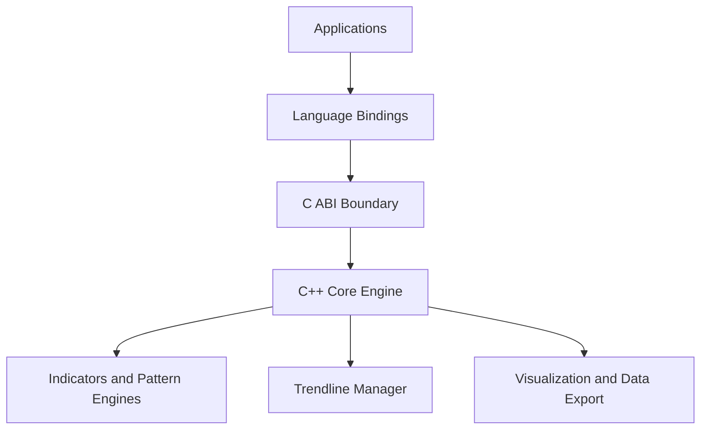
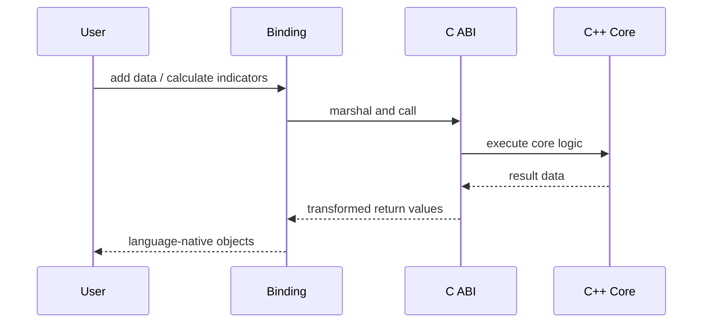

# Architecture Overview

This document gives a top-to-bottom view of the system. For deeper functional behavior, continue into the `concepts/` section.

## Layered Architecture

## Runtime Call Topology

## Internal Components

- Chart construction and mutation: `Chart`
- Column and box model: `Column`, `Box`
- Trendline maintenance: `TrendLineManager`
- Indicator stack: `Indicators` and helper analyzers
- Visualization/export: `Visualization` and export structs

## Deep Dives

- [Chart Model](concepts/chart-model.md)
- [Chart Construction Rules](concepts/chart-construction.md)
- [Indicators and Signals](concepts/indicators-and-signals.md)
- [Patterns and Objectives](concepts/patterns-and-objectives.md)
- [Trendlines and Bias](concepts/trendlines-and-bias.md)
