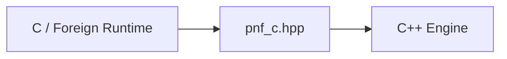

# C ABI Reference

The C ABI is the stable interoperability boundary for all non-C++ bindings.

Source:
- `bindings/c/pnf_c.hpp`
- `bindings/c/pnf_c.cpp`

## Design Contract

- Opaque handle ownership (`PnfChart*`, `PnfIndicators*`)
- C-compatible enums and POD structs
- Explicit allocation/free symmetry for strings and arrays
- No hidden global mutable state required by callers

## ABI Layers



## Lifecycle

### Chart

1. `pnf_chart_create` or `pnf_chart_create_default`
2. data ingestion and reads
3. `pnf_chart_destroy`

### Indicators

1. `pnf_indicators_create_*`
2. `pnf_indicators_calculate`
3. read values/arrays/strings
4. free arrays/strings returned
5. `pnf_indicators_destroy`

## Memory Ownership Rules

Caller must free memory from:
- `pnf_chart_to_string`, `pnf_chart_to_ascii`, `pnf_chart_to_json`
- `pnf_indicators_summary`, `pnf_indicators_to_string`
- `pnf_indicators_*_values`
- `pnf_indicators_signals`
- `pnf_indicators_patterns`
- `pnf_indicators_support_levels`
- `pnf_indicators_resistance_levels`

Free APIs:
- `pnf_free_string`
- `pnf_free_double_array`
- `pnf_free_signal_array`
- `pnf_free_pattern_array`
- `pnf_free_level_array`

## API Families

- Version: `pnf_version_*`
- Config defaults: `pnf_chart_config_default`, `pnf_indicator_config_default`
- Chart create/destroy/input/query/export
- Indicators create/configure/calculate/query/export

## Error Model

- Most APIs return safe defaults on invalid input.
- Null/invalid handles are caller bugs; behavior can be undefined in some paths.
- Use defensive checks in higher-level bindings before dispatch.

## Threading Model

- No built-in synchronization around chart/indicator mutation.
- Do not concurrently mutate the same handle from multiple threads.

## Minimal Example

```c
PnfChartConfig cfg = pnf_chart_config_default();
cfg.box_size_method = PNF_BOX_SIZE_FIXED;
cfg.box_size = 1.0;
PnfChart* chart = pnf_chart_create(&cfg);
pnf_chart_add_price(chart, 100.0, 1700000000);
char* s = pnf_chart_to_string(chart);
pnf_free_string(s);
pnf_chart_destroy(chart);
```
