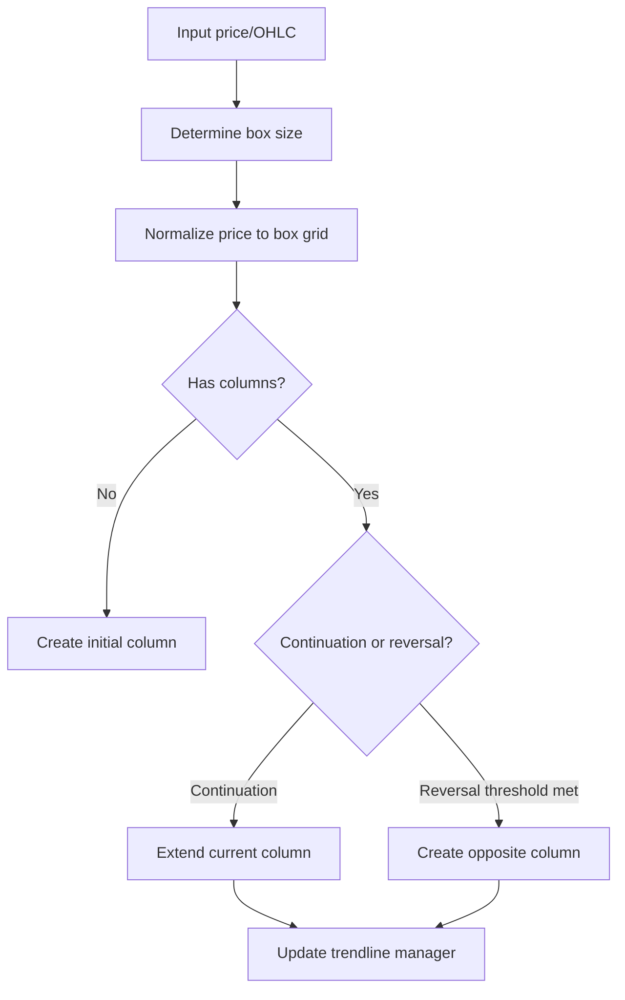

# Chart Construction Rules

## Price Intake Modes

- `Close`: uses close (or single price) for progression
- `HighLow`: consumes bar extremes and can create richer intrabar movement effects

## Construction Pipeline

## Reversal Logic

If active column is `X`:
- continue `X` when price advances by at least one box
- reverse to `O` when retrace reaches `reversal * box_size`

If active column is `O`:
- continue `O` when price drops by at least one box
- reverse to `X` when rise reaches `reversal * box_size`

## Box Size Methods

- `Fixed`: constant configured box size
- `Traditional`: dynamic size based on price bands
- `Percentage`: proportional to price
- `Points`: additive points-based step

## Deterministic Behavior Notes

- Same input sequence + same config => deterministic chart result.
- Changing box-size method can change both column boundaries and all downstream indicators/patterns.
