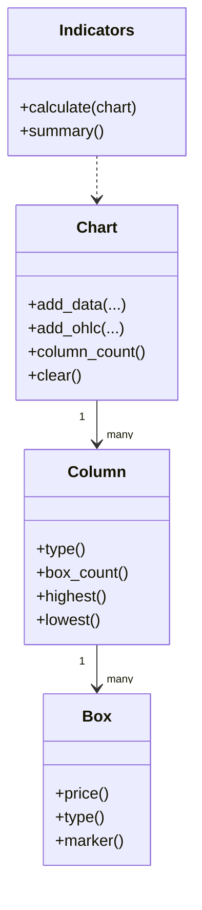

# Chart Model

## Primary Domain Objects

- `Chart`: owns columns, configuration, trendline manager, and lifecycle state.
- `Column`: directional sequence of boxes (`X`, `O`, or `Mixed`).
- `Box`: atomic plotted unit at a normalized price.
- `Indicators`: computes analytics over chart columns.

## Object Relationships

## Configuration Model

`ChartConfig`
- `method`: `Close` or `HighLow`
- `box_size_method`: `Fixed`, `Traditional`, `Percentage`, `Points`
- `box_size`: explicit value for fixed/points/percentage modes
- `reversal`: reversal threshold in box units

`IndicatorConfig`
- SMA periods
- Bollinger period and standard deviations
- RSI period and thresholds
- Alert and congestion thresholds

## State Invariants

- Column count grows monotonically unless `clear()` is called.
- Each column has a dominant direction (`X` or `O`), with possible `Mixed` transitional semantics.
- Box prices are aligned to a grid derived from current box-size policy.
