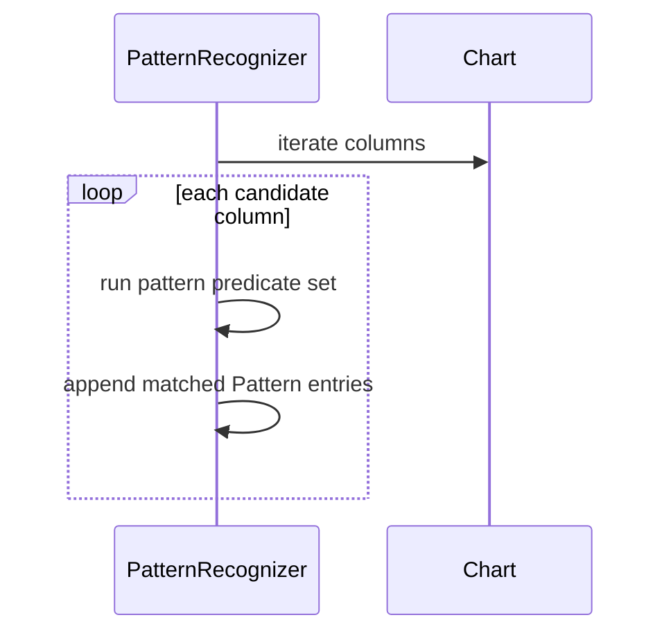

# Patterns and Price Objectives

## Pattern Families

The recognizer supports bullish and bearish structural patterns, including:

- Double/triple/quadruple breakouts and breakdowns
- Catapults and signal-reversed variants
- Triangle and trap patterns
- Pole and spread patterns

## Pattern Detection Pass

## Pattern Output

Each `Pattern` includes:
- `type`
- `start_column`
- `end_column`
- `price`
- `is_bullish` (binding-dependent representation)

## Price Objectives

Price objectives are generated through vertical-count style calculations.

`PriceObjective` fields:
- `target_price`
- `base_column`
- `box_count`
- `is_bullish`

## Recommended Usage

1. Recalculate indicators after each data batch.
2. Inspect `patterns()` and `objectives()` together.
3. Filter by direction and confidence criteria in application code.
