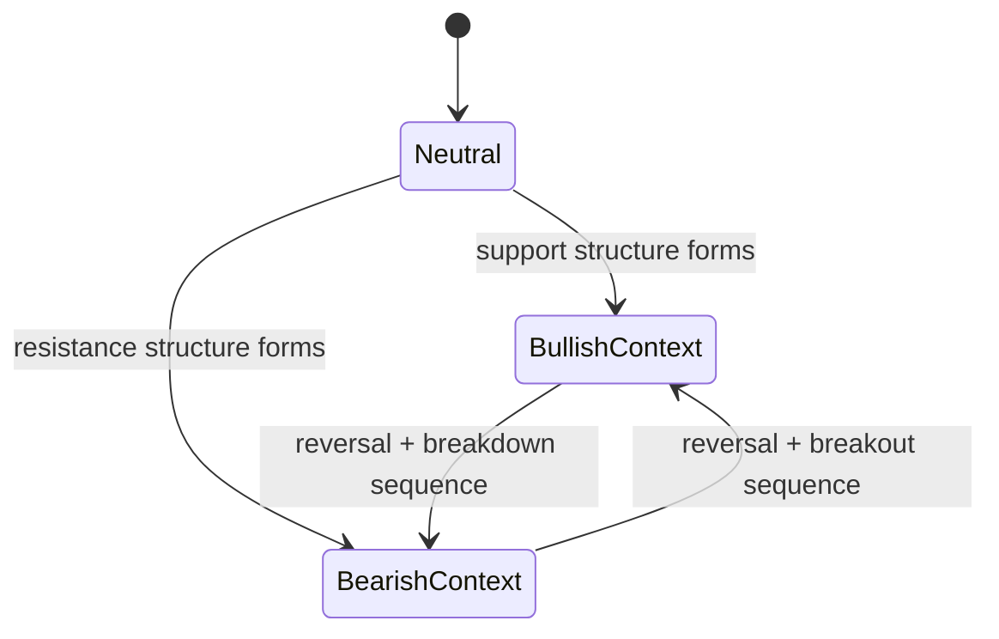

# Trendlines and Market Bias

## Trendline Manager

`Chart` owns a trendline manager that tracks:
- Bullish support lines
- Bearish resistance lines

Trendline updates happen as part of chart mutation flow.

## Bias Semantics

- `has_bullish_bias()` indicates chart context favorable to bullish continuation logic.
- `has_bearish_bias()` indicates chart context favorable to bearish continuation logic.
- `should_take_bullish_signals()` and `should_take_bearish_signals()` expose stricter gating helpers.

## Bias and Support/Resistance Checks

- `is_above_bullish_support(price)`
- `is_below_bearish_resistance(price)`

These are useful for signal filtering and strategy confirmation.

## Lifecycle

