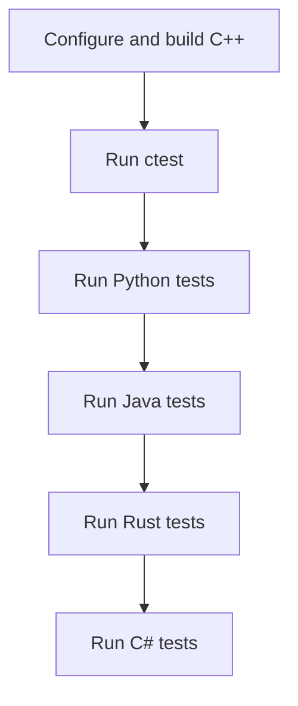

# Build and Test

This page is the authoritative command matrix for local validation.

## Build Core Library

```bash
cmake -S . -B build-linux -DCMAKE_BUILD_TYPE=Release -DPNF_BUILD_VIEWER=OFF
cmake --build build-linux -j$(nproc)
```

## Run Core C++ Tests

```bash
ctest --test-dir build-linux --output-on-failure
```

## Run Binding Tests

### Python

```bash
PYTHONPATH=build-linux/python python3 -m pytest bindings/python/test_pypnf.py -q
```

### Java

```bash
cd bindings/java
mvn test -Dmaven.repo.local=/tmp/m2 -Dnative.library.path=/home/gregorian-rayne/ChartSystem/build-linux/lib
```

### Rust

```bash
cd bindings/rust
cargo test --release
```

### C#

```bash
cd bindings/csharp
DOTNET_CLI_HOME=/tmp/dotnet DOTNET_SKIP_FIRST_TIME_EXPERIENCE=1 dotnet test -c Release
```

## Full Validation Order



## Expected Success Criteria

- All test suites return exit code `0`
- No missing native library errors (`pnfjni`, `libpnf.so`, etc.)
- No runtime ABI mismatch between bindings and core library
