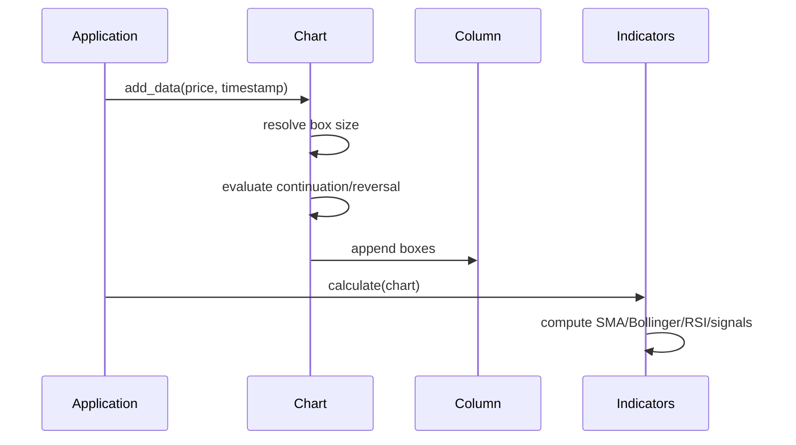

# First Chart Walkthrough

This walkthrough shows the same workflow in C++ and bindings.

## C++ Example

```cpp
#include <pnf/pnf.hpp>
#include <chrono>

int main() {
    pnf::ChartConfig config;
    config.method = pnf::ConstructionMethod::Close;
    config.box_size_method = pnf::BoxSizeMethod::Fixed;
    config.box_size = 1.0;
    config.reversal = 3;

    pnf::Chart chart(config);
    auto t = std::chrono::system_clock::now();
    chart.add_data(100.0, t);
    chart.add_data(102.0, t + std::chrono::minutes(1));
    chart.add_data(97.0, t + std::chrono::minutes(2));

    pnf::Indicators indicators;
    indicators.calculate(chart);

    return 0;
}
```

## What Happens Internally



## Cross-Language Equivalents

- Python: `pypnf.Chart`, `pypnf.Indicators`
- Java: `com.pnf.Chart`, `com.pnf.Indicators`
- Rust: `pnf::Chart`, `pnf::Indicators`
- C#: `PnF.Chart`, `PnF.Indicators`

See binding-specific API guides for full signatures.
