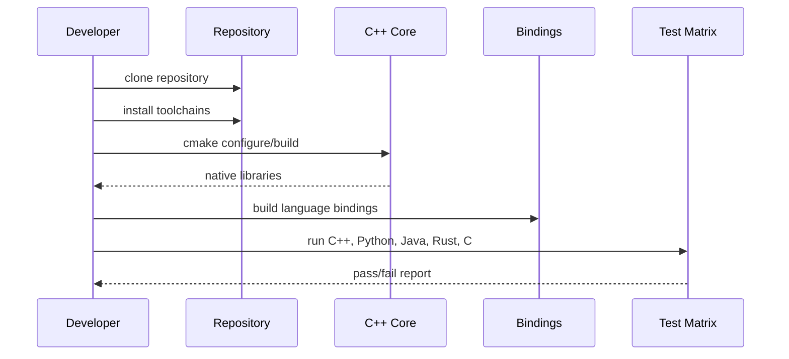

# Getting Started Overview

Use this path when onboarding to the repository.

1. Install build and runtime dependencies.
2. Build the C++ core.
3. Run the full test matrix.
4. Run one end-to-end sample for your target binding.

## Onboarding Flow

## Entry Points

- [Install Prerequisites](install.md)
- [Build and Test](build-and-test.md)
- [First Chart Walkthrough](first-chart.md)
