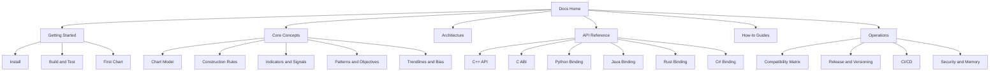

# PnF Chart System Documentation

This documentation is organized for three audiences:
- Application developers integrating the library
- Binding users working in Python, Java, Rust, and C#
- Maintainers publishing and operating releases

## Documentation Architecture

## Start Here

- [Getting Started Overview](getting-started/overview.md)
- [Install Prerequisites](getting-started/install.md)
- [Build and Test Matrix](getting-started/build-and-test.md)
- [First Chart Walkthrough](getting-started/first-chart.md)

## Core Understanding

- [Architecture Overview](architecture.md)
- [Chart Model](concepts/chart-model.md)
- [Chart Construction Rules](concepts/chart-construction.md)
- [Indicators and Signals](concepts/indicators-and-signals.md)
- [Patterns and Price Objectives](concepts/patterns-and-objectives.md)
- [Trendlines and Market Bias](concepts/trendlines-and-bias.md)
- [Numeric Examples](examples.md)

## API Reference

- [C++ API](reference/cpp-api.md)
- [C ABI](bindings/c-abi.md)
- [Python API](bindings/python.md)
- [Java API](bindings/java.md)
- [Rust API](bindings/rust.md)
- [C# API](bindings/csharp.md)

## Guides

- [Common Workflows](guides/common-workflows.md)
- [Troubleshooting](guides/troubleshooting.md)

## Operations

- [Compatibility Matrix](operations/compatibility-matrix.md)
- [Release and Versioning](operations/release-and-versioning.md)
- [CI/CD Design](operations/ci-cd.md)
- [Security and Memory Ownership](operations/security-memory.md)

## Internal-Only Material

Internal publishing and hosting runbooks are intentionally stored outside public docs in `internal/`.
