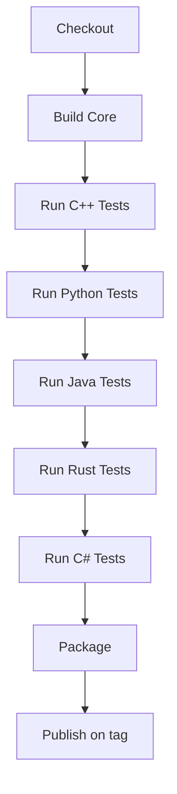

# CI/CD Design

## Pipeline Stages

## Principles

- Fail fast on compile or core test errors.
- Do not publish unless full matrix passes.
- Publish only from tagged commits.
- Use per-registry scoped secrets.

## Required Secrets (when publishing)

- `PYPI_API_TOKEN`
- Maven Central credentials/token pair
- `CARGO_REGISTRY_TOKEN`
- `NUGET_API_KEY`
- GPG material for Maven Central signing
